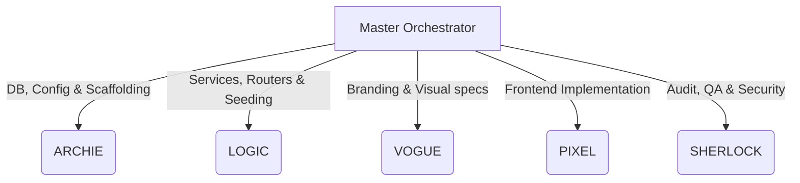

# Project Status: Salary Management System

Welcome to the **Salary Management System**! This document provides an executive summary of the project, our architectural choices, what has been built so far, and the next steps in our development roadmap.

---

## 🎯 Project Overview
This is a production-quality, minimal **Salary Management System** designed for the **HR Manager** persona managing **10,000 employees**.

### Key System Requirements
1. **Employee CRUD Management**: Add, view, update, and delete employees via a modern frontend dashboard.
2. **Interactive Salary Insights & Analytics**:
   - Minimum, maximum, and average salary calculations by **Country**.
   - Average salary by **Job Title** per country.
   - Additional metrics (e.g., department distributions, top earners).
3. **High-Performance Seeding**: Seed 10,000 realistic employees performantly (**target: < 3 seconds**) using raw SQL bulk inserts.
4. **Architectural & Design Excellence**:
   - Clean Architecture with clear **Service Layer Separation** to ensure business logic is fully decoupleable and testable without spinning up HTTP routes.
   - 100% test coverage for core components using TDD (Test-Driven Development).
   - Premium aesthetic with modern CSS, dark mode support, glassmorphism cards, and sleek interactive charts.

---

## 🏗️ System Architecture & Stack

We've selected a decoupled, modern, and highly pragmatic technology stack:

```
┌─────────────────────────────────┐        HTTP / REST API        ┌─────────────────────────────────┐
│           FRONTEND              │ ◄───────────────────────────► │            BACKEND              │
│       (Next.js 14 App Router)    │                               │           (FastAPI)             │
│  - TypeScript & Tailwind CSS    │                               │  - SQLAlchemy ORM               │
│  - shadcn/ui Component Suite    │                               │  - Pydantic Validation          │
│  - Recharts for Salary Insights │                               │  - SQLite (In-Memory for tests) │
│         [Port: 3000]            │                               │          [Port: 8000]           │
└─────────────────────────────────┘                               └────────────────┬────────────────┘
                                                                                   │ SQLAlchemy ORM
                                                                                   ▼
                                                                  ┌─────────────────────────────────┐
                                                                  │           SQLite DB             │
                                                                  │         (Local File)            │
                                                                  └─────────────────────────────────┘
```

### Decoupled Backend Data-Flow
```
HTTP Request ──► FastAPI Router ──► Pydantic Schema ──► Service Layer ──► SQLAlchemy Model ──► Database
```
This architecture isolates HTTP routing details from core logic, allowing our backend services to remain 100% independent and highly testable.

---

## 🚀 Current Implementation Progress

We are currently developing on the **`feature/backend`** branch. Our backend core services are fully implemented and backed by a comprehensive suite of **30 TDD-validated unit tests**, all of which are **passing in just 0.07 seconds**!

### Done So Far (Phase 1: Backend Core)
* **Commit 1: Scaffolding (ARCHIE)**: Repository setup, Pydantic-settings config, minimal FastAPI entry point, health checks, and architectural plans.
* **Commit 2: Data Modeling (ARCHIE)**: Defined the `Employee` model with high-performance query indexes on `country` and `job_title` to speed up analytics queries. Formulated robust validation rules via Pydantic schemas (`EmployeeCreate`, `EmployeeUpdate`, `EmployeeResponse`).
* **Commit 3: CRUD Services (LOGIC)**: Implemented full-coverage database services for employee management (`app/services/employee_service.py`), including secure duplicate handling, pagination, and multi-parameter filters (by name, country, job title).
* **Commit 5: Analytics Services (LOGIC)**: Developed lightning-fast grouping and aggregation algorithms (`app/services/analytics_service.py`) to generate country-specific and global salary stats (min, max, average, department averages) on the database level.

---

## 📈 TDD Test Suite Health (30/30 Passing)

We enforce standard Test-Driven Development (Red-Green-Refactor). Our test suite consists of **30 high-coverage tests** that run in **0.07 seconds** in an isolated SQLite in-memory environment:

| Module / Test Group | Cases | Status | Focus |
|---|---|---|---|
| `test_schemas.py` | 13 | ✅ **PASSED** | Field validation constraints, salary ranges, email verification |
| `test_employee_service.py` | 13 | ✅ **PASSED** | Paginated listing, strict filters, name search, CRUD execution |
| `test_analytics_service.py`| 4  | ✅ **PASSED** | Grouped country aggregates, job-title aggregations, empty database safety |

---

## 🗺️ Multi-Agent Development Roadmap

To finish this build to Incubyte's elite standards, we use a structured, multi-agent pipeline:



Here is the plan for what remains:

### 1. Backend API Routing & Bulk Seeding (Active Tasks)
* **Task 4: Employee & Analytics Routers (LOGIC)**: Wire services into FastAPI router controllers (`app/routers/employees.py` & `app/routers/analytics.py`) and write end-to-end integration tests using `httpx.AsyncClient`.
* **Task 6: High-Performance Seeding (LOGIC)**: Write the bulk-insert seed script (`app/seed/seed.py`) using `executemany()` to import 10,000 employees in under 3 seconds, drawing mock data from custom `first_names.txt` and `last_names.txt`.

### 2. Premium Frontend Dashboard (Next Phase)
* **Task 7: Layout Design Spec (VOGUE)**: Design an elite, sleek dark-mode layout with custom brand colors, custom font selections (Outfit/Geist), glassmorphism cards, and interactive hover details.
* **Task 8: UI Implementation (PIXEL)**: Build the Next.js 14 frontend using `shadcn/ui`, dynamic tables with instant filtering, and responsive dialogs for Employee CRUD. Integrate interactive salary charts using `Recharts` connected to the `/api/analytics` endpoint.

### 3. QA, Security & Deployment (Final Phase)
* **Task 9: Audit & Live Deployment (SHERLOCK & ARCHIE)**: Perform a rigorous security review (verify validation checks, RLS principles, and error handler paths). Set up automatic deployment on Render (Backend) and Vercel (Frontend), preparing the final assessment video demo.
* **Task 10: bonus Graphify (ARCHIE)**: Run codebase visualization hooks to generate a interactive architecture graph mapping our completed product.
